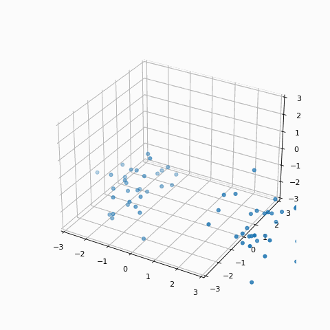

# Fokker-Plank-Type Generative Model
## Initial Formulation

A random variable:  
$\gamma_t : \Omega \rightarrow \mathcal{X}$ with measure theory stuff: $(\Omega,\mathcal{F},P)$   
$\gamma_t^{-1}(S) = \{w \in \Omega | \gamma(w) \in S \}, S \in \mathcal{X}$  
$p_t(x) = P(\gamma_t^{-1}(x))$  

General sde can be written as the following:  
$d\gamma_t(S) = \mu_t(\gamma_t) dt + \sigma(\gamma_t, t)dB_t$ where $B_t$ is a weiner process.  

Alternatively this can be written as a Fokker-Planck equation:    
$$\frac{\partial}{\partial t} p_t(x) = \frac{\partial}{\partial x} [ \mu_t(x)p_t(x) ] + \frac{\partial}{\partial x^2}[ D_t(x)p_t(x) ] $$

Note: the general conservation equation is:  
$\frac{\partial}{\partial t} p_t(x) = -\nabla\cdot[f_t(x)p_t(x)]$  

We are interested in the following form of $f(\cdot)$  
$$ f(y) = \int p_t(x) \frac{x-y}{\Vert x-y \Vert^2} dx$$  
By using using this equation in expectation we see  
$f(y) = \mathbb{E}_{p_t(x)} \left[ \frac{x-y}{\Vert x-y\Vert^2} \right]$

In order to ensure that batching works properly, we can include a weiner process, and pull towards the origin s.t. taking batches in the expectation result in identical terminal distributions

$$ \frac{\partial}{\partial t}p_t(x) = -\nabla \cdot \left( \mathbb{E}_{p_t(x)} \left[ \frac{x-y}{\Vert x - y\Vert^2} -x \right] \right) + \lambda \nabla^2\cdot[ D_t(x)p_t(x) ]$$  

By taking samples, we can visualize the forward process in the following manner:  

    

---

## Score-Based Modelling
Score-based modelling can be generalized to look at Ito sde's of the following form:  
$dx = f_t(x)dt + g(t)dw$  
To sample from a score based model, we just need to invert the sde as follows:  
$dx = [f_t(x) - g(t)^2 \nabla_{x}\textrm{log }p_t(x)]dt + g(t)d\bar{w}$  
where $\bar{w}$ is the weiner process when time flow backwards.  

We can estimate $\nabla_x p_t(x)$ by learning $s_{\theta}(x,t)$:  
$$\theta^* = \mathrm{argmin}_{\theta}\left( \mathbb{E}_{t\sim U(0,1)}\mathbb{E}_{x_0\sim p_{\mathrm{data}}(x)} \mathbb{E}_{x_t\sim p(x_t|x_0)} \lambda_t \left[\Vert s_\theta(x_t,t)- \nabla_{x_t}\textrm{log }p_{0t}(x_t|x_0) \Vert^2_2 \right] \right)$$
